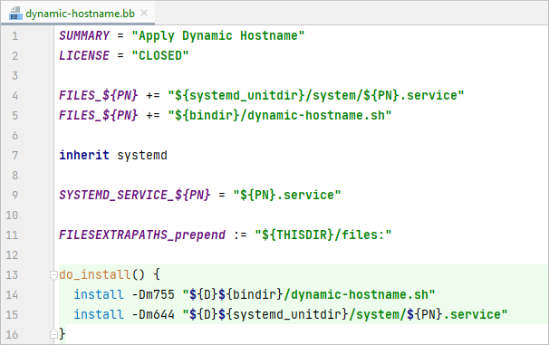

# BitBake IntelliJ Plugin

Highlight `.bb`/`.bbappend`/`.bbclass`/`.inc` files in JetBrains IDEs to make working with BitBake-based projects (like
anything based on Yocto Project) easier.



## How to install

The easiest way is to just install the plugin from the official JetBrains Marketplace:

[](https://plugins.jetbrains.com/plugin/19471-bitbake)

Or you can download the [latest release](../../releases/) and install it in your favourite JetBrains IDE like this:  
*File ➜ Settings... ➜ Plugins ➜ ⚙️ Gear Button (Manage Repositories, Configure Proxy or Install Plugin from Disk) ➜
Install Plugin from Disk...*

## How to build
If you have Git, Gradle and Java installed, just use the following command to build the plugin:

```shell
gradle build -Pversion=$(git describe --dirty --tags --always)
```

The installable `.zip` file of the plugin can then be found in `build/distributions`.

<details>
<summary>Alternatives without installing Gradle & Java system-wide</summary>

If you don't want to install Gradle & Java locally, you can use e. g. Docker or Podman:
```shell
$ docker run --rm -it -u "$(id -u)" \
    -v "$(pwd)":/home/gradle/project -w /home/gradle/project \
    docker.io/library/gradle:7.4-jdk11 bash
$ gradle build -Pversion=$(git describe --dirty --tags --always)
```

You can also use Conda to install Gradle & Java in a separate environment:
```shell
$ conda create -n jetbrains-plugin-development -c conda-forge gradle=7.4.* openjdk=11.*.*
$ conda activate jetbrains-plugin-development
$ gradle build -Pversion=$(git describe --dirty --tags --always)
```

</details>
